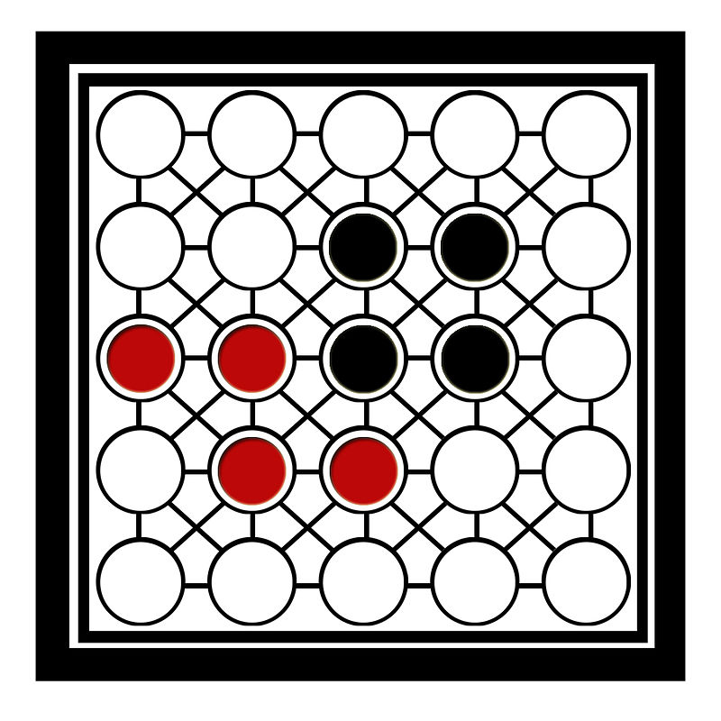

\begin{center}
\includegraphics[width=200pt]{img/feup.png}
\end{center}

\newpage

\tableofcontents

\newpage

# Introduction

The primary goal of this project is to design and develop a faithful recreation of the
board game **Teeko** using logic programming, specifically, using the programming language **Prolog**
and the [SICStus Prolog][1] development system.
The end result of the project should be a playable version of the game in a
[command-line interface (CLI)][2] inside the SICStus Prolog interactive shell.

This project was developed using **Git** for version control and an online GitHub repository
is available at [github.com/glhrmv/teeko][3], containing all of the work developed.

[1]: https://sicstus.sics.se/
[2]: https://en.wikipedia.org/wiki/Command-line_interface
[3]: https://github.com/glhrmv/teeko

\newpage

# Teeko

## Description

Teeko is an abstract strategy game invented by John Scarne in 1937 and re-released in refined
form in 1952 and again in the 1960s.
Teeko was marketed by Scarne's company, John Scarne Games Inc.;
its quirky name, he said, borrowed letters from Tic-tac-toe, Chess, Checkers, and Bingo [@teeko_etymology].

Teeko is a 2-player board game played on a board of 5x5 possible positions.
Game pieces in Teeko are typically called '**markers**', and will henceforth be referred to as such.
Both players have 4 markers each, with a particular colour of marker for each player.

In the original Teeko game, players had two (2) colours of markers: black, and red,
with the player controlling the black markers known as Black, and the other as Red.

{width=500px}

## Gameplay and rules

Teeko can be divided into two phases: the drop phase and the move phase.

The game starts on an empty board and the first phase, the **drop phase**, begins. It consists
of players taking turns placing their markers (4 for each, 8 total) into empty cells on the board,
with Black taking the first turn.
If a player isn't careful, they can risk defeat in the drop phase by not preventing the
opponent from placing their markers in a winning position.

If no player won in the drop phase, the **move phase** begins.
In the move phase, players take turns moving one of their markers until a winning position is found.
A game piece can only be moved to one empty adjacent space, in any direction (horizontal, vertical, or diagonal).

## Win condition

The game is over and a player is victorious only when their markers are arranged in a straight line in any
direction (horizontal, vertical, or diagonal) or when they form a square of four (4) adjacent markers.

{width=300px height=300px}

# Game logic

The source code for this project was written iteratively, but with the everpresent aim of
modularizing all logic into its own respective file, e.g. all menu-related logic was
placed in `menu.pl`, etc.. The entry point of the game itself is located in `teeko.pl`,
wherein all of the SICStus Prolog standard library modules and the other source files
written are loaded.

The following is all of the source code files used in development.

```
src/
├── board_state.pl
├── bot.pl
├── graphics.pl
├── input.pl
├── menu.pl
├── pvp.pl
├── rules.pl
├── teeko.pl
├── test.pl
└── utils.pl
```

Where:

- `board_state.pl` contains the initial game board definition.
- `bot.pl` contains all bot-related logic.
- `graphics.pl` contains all graphics-related logic, i.e., printing the game board onto the screen.
- `input.pl` contains all user input-related logic, e.g., parsing a user's desired position to move to.
- `menu.pl` contains the main menu logic.
- `pvp.pl` contains all player-related logic, e.g., moving pieces.
- `rules.pl` contains all rules-related logic
- `teeko.pl` is the entry point of the project, containing the `teeko/0` predicate that will initiate play.
- `utils.pl` contains miscellaneous utility predicates used throughout the project.

Some concessions had to be made regarding the representation of the players' markers
on the game board, due to the restricted nature of the command-line interface and the
difficulties faced when trying to use special Unicode characters to represent players
with black and red circle symbols, for each respective player.

The SICStus Prolog development system does not provide an easy way to write
strings onto the screen with special Unicode characters, e.g, `├` or `╗`, with its
[`write/1`][4] predicate.
Instead, for printing individual special symbols like these and others, the usage
of dedicated predicates like [`put_code/1`][5] were required.
This is good enough for displaying the board and the main menu with these sorts of
special characters for a better aesthetic, but an issue arised when trying to come up
with symbols for displaying each player's markers. Initially, the red circle symbol
(U+1F534) was chosen for the Red player's markers, and the black circle symbol (U+2B24)
for Black player's markers. This quickly posed a problem when trying to test the game
under different conditions, i.e., terminal emulators, operating systems,
colour schemes, etc., as telling players apart was a very different experience depending
on the environment.

Instead of trying to find a cross-platform solution for this problem, the "Black" and "Red"
terminology was abandonded in favour of a more traditional approach: one player would control
markers that look like `O` on the screen, and would be referred to as Player O, and the other
player's markers look like `X` on the screen, and known as Player X.

[4]: https://sicstus.sics.se/sicstus/docs/4.2.0/html/sicstus/mpg_002dref_002dwrite.html
[5]: https://sicstus.sics.se/sicstus/docs/4.2.0/html/sicstus/mpg_002dref_002dput_005fcode.html

## Board definition

The game board will be defined internally as a list of lists. Each element of
the outer list represents a row in the board, with each element of a row
corresponding to a cell, i.e., a position on the board.
Here are some examples of board states:

~~~prolog
/* Starting board: All cells are empty, defined by the atom e */
board([
  [e, e, e, e, e],
  [e, e, e, e, e],
  [e, e, e, e, e],
  [e, e, e, e, e],
  [e, e, e, e, e]
]).
~~~

~~~prolog
/* Intermediate board: Some markers on the board, neither player winning */
/* The atom o represents the O markers */
/* The atom x epresents the X markers */
board([
  [e, e, o, e, e],
  [e, e, o, x, o],
  [e, e, o, x, e],
  [e, x, x, e, e],
  [e, e, e, e, e]
]).
~~~

~~~prolog
/* Finishing board: Player O wins in this scenario */
board([
  [e, e, e, e, e],
  [e, x, o, e, e],
  [e, e, o, e, e],
  [e, x, o, x, e],
  [e, x, o, e, e]
]).
~~~

## Board visualization

The game board will be defined as such, where:

- `O` represents an O marker
- `X` represents an X marker

~~~
     A  B  C  D  E
    ┌───┬───┬───┬───┬───┐
  0 │   │ X │ O │ X │ X │
    ├───┼───┼───┼───┼───┤
  1 │   │   │   │ O │ O │
    ├───┼───┼───┼───┼───┤
  2 │   │ O │   │   │   │
    ├───┼───┼───┼───┼───┤
  3 │   │   │   │   │   │
    ├───┼───┼───┼───┼───┤
  4 │   │ X │   │   │   │
    └───┴───┴───┴───┴───┘
~~~

In order to print this board on the screen, some Prolog predicates need to be defined.
The main predicate that will print the state of the game is called `display_game(+Board, +Player)`.
It will first print the board in a way similar to the example above, and then print
some information regarding what can be done from this state: either a winning condition is
found and victory is granted to the respective player and the game is over,
or it will display which player's turn it is to move.

This predicate has been implemented in the following way:

~~~prolog
display_board(Board) :-
	print_board(Board).
	
print_board(Board) :-
  nl,
  length(Board, Size),
  print_letters(Size, Size),
  print_top_lines(Size),
  print_squares(0, Size, Board),
  print_bottom_lines(Size).

/* Print letters on top of the board */
print_letters(Size, Size) :-
  Size > 0,
  write('    '),
  print_letter(Size, Size).

print_letter(1, Size) :-
  write(' '),
  C is 65+Size-1,
  put_code(C),
  write(' '), nl.

print_letter(Line, Size) :-
  write(' '),
  C is 65+Size-Line,
  put_code(C),
  write(' '),
  Nextline is Line-1,
  print_letter(Nextline, Size).

/* Print the top line of the board */
print_top_lines(Column) :-
  Column > 0,
  write('    '),
  lt_corner,
  print_top_line(Column).

print_top_line(1) :-
  horiz,
  horiz,
  rt_corner, nl.

print_top_line(Column) :-
  horiz,
  horiz,
  top_con,
  Nextcolumn is Column-1,
  print_top_line(Nextcolumn).

/* Print the bottom line line of the board */
print_bottom_lines(Column) :-
  Column > 0,
  write('    '),
  lb_corner,
  print_bottom_line(Column).

print_bottom_line(1) :-
  horiz,
  horiz,
  rb_corner, nl.

print_bottom_line(Column) :-
  horiz,
  horiz,
  bottom_con,
  NextColumn is Column-1,
  print_bottom_line(NextColumn).

/* Print the middle of the board */
print_squares(_, _, []).

print_squares(0, Size, [Line|Board]) :-
  print_markers(0, Size, Line),
  print_squares(1, Size, Board).

print_squares(Currentline, Size, [Line|Board]) :-
  print_middle_lines(Size),
  print_markers(Currentline, Size, Line),
  Nextline is Currentline+1,
  print_squares(Nextline, Size, Board).

/* Print the horizontal lines and connectors of the board */
print_middle_lines(Size) :-
  Size > 0,
  write('    '),
  left_con,
  print_middle_line(Size).

print_middle_line(1) :-
  horiz,
  horiz,
  right_con, nl.

print_middle_line(Size) :-
  horiz,
  horiz,
  middle,
  Nextsize is Size-1,
  print_middle_line(Nextsize).

/* Print the markers and the vertical lines */
print_markers(Currline, _, Line) :-
  write('  '),
  write(Currline),
  write(' '),
  print_marker(Line),
  vert, nl.

print_marker([]).

print_marker([e|Line]) :-
  vert,
  write('  '),
  print_marker(Line).

print_marker([o|Line]) :-
  vert,
  black_circle,
  write(' '),
  print_marker(Line).

print_marker([x|Line]) :-
  vert,
  white_circle,
  write(' '),
  print_marker(Line).
~~~

## Valid moves

In order to find out what all of the possible moves for a particular player are
from a given board state, the predicate `valid_moves(+Board, +Player, -ListOfMoves)` was
developed. Its implementation is below.

~~~prolog
valid_moves(Player, Board, List) :-
  player(Player, Letter),
  count_markers(Board, Letter, Count),
  Count < 4,
  findall(
  [Col, Line], 
  (
    col(Col), line(Line), 
    check_free_space(Board, Col, Line, Value), 
    Value = 'e' 
  ), List).

valid_moves(Player, Board, List) :-
  player(Player, Letter),
  count_markers(Board, Letter, Count),
  Count = 4,
  findall(
  [Col, Line, ColP, LineP],
  ( 
    col(Col), line(Line), col(ColP), line(LineP),
    check_free_space(Board, Col, Line, Value), Value = Letter,
    check_free_space(Board, ColP, LineP, ValueP), ValueP = 'e',
    check_adjacent(Col, Line, ColP, LineP)
  ), List).
~~~

## Moving markers

The ability for the player to move their markers around the board is
crucial to the game, so a predicate `move(+Board, +Column, +Line, +Marker, -NewBoard)`
was created. It takes in a board state (i.e., the current state), the coordinates
of the marker to be moved to `Column` and `Line`, the marker to move (`x` or `o`), and
a `NewBoard` variable will be unified with a board structure if the move is possible.

If a move is not possible, e.g., if the desired position is not an empty position,
the move will not be performed and the player will have the option to try again.
This predicate has been implemented in the following way:

~~~prolog
move(B, X, Y, Letter, R) :-
  find_line(B, X, Y, Letter, R).

find_line([L|Ls], 0, Y, Z, [R|Ls]) :-
  find_column(L,Y,Z,R).

find_line([L|Ls], X, Y, Z, [L|Rs]) :-
  X > 0 ,
  X1 is X-1 ,
  find_line( Ls , X1 , Y , Z , Rs ).

find_column([_|Cs], 0, Z, [Z|Cs]).
find_column([C|Cs], Y, Z, [C|Rs]) :-
  Y > 0 ,
  Y1 is Y-1 ,
  find_column( Cs , Y1 , Z , Rs ).
~~~

## End of game detection

As stated in an earlier section, there are 2 ways for a player to win
a game of Teeko. They are:

- Forming a straight line of 4 markers (in a horizontal, vertical, or diagonal direction).
- Forming a 'square' of 4 adjacent markers.

In order to detect if a win condition has been met by a given player, the predicate
`game_over(+Board, -Winner)` was created. It takes in the state of the board and will
unify `Winner` with a winning player, if any was found. This predicate has been implemented 
in the following way:

~~~prolog
/* Vertical win condition */
game_over(Board, Player) :-
  append(_, [Column | _], Board),
  check_column(Column, Player).

/* Horizontal win condition */
game_over(Board, Player) :-
  append(_, [Col1, Col2, Col3, Col4 | _], Board),
  check_rows(Col1, Col2, Col3, Col4, Player).

/* Diagonal win condition type 1 (decreasing rows) */
game_over(Board, Player) :-
  append(_, [Col1, Col2, Col3, Col4 | _], Board),
  Col2 = [_ | NewCol2],
  Col3 = [_, _ | NewCol3],
  Col4 = [_, _, _ | NewCol4],
  check_rows(Col1, NewCol2, NewCol3, NewCol4, Player).

/* Diagonal win condition type 2 (increasing rows) */
game_over(Board, Player) :-
  append(_, [Col1, Col2, Col3, Col4 | _], Board),
  Col1 = [_, _, _ | NewCol1],
  Col2 = [_, _ | NewCol2],
  Col3 = [_ | NewCol3],
  check_rows(NewCol1, NewCol2, NewCol3, Col4, Player).

/* Square win condition */
game_over(Board, Player) :-
  append(_, [Col1, Col2| _], Board),
  Col1 = [_| Col3],
  Col2 = [_| Col4],
  check_rows(Col1, Col2, Col3, Col4, Player).
  
game_over(Board, Player) :-
  append(_, [Column | _], Board),
  check_column(Column, Player).
~~~

## Board state evaluation

According to the project specifications, a predicate `value(+Board, +Player, -Value)`
was to be created so that the state of the board could be evaluated. Since there was
no real need found for such a predicate in the development of this project, the
`value/3` predicate created merely serves as a *wrapper* to `get_move/4`, which is
defined in the next section.

~~~prolog
value(Player, Board, Value) :-
	get_move(Player, Board, _, Value).
~~~

## Computer movement

There are two levels of gameplay that the computer can follow, either
an 'easy' level (level 1), where moves are simply chosen at random, and
a 'hard' level (level 2), whereby the computer will attempt to predict which
moves will drive towards a winning position, or toward blocking the opponent
from reaching a winning position. 

A predicate `choose_move(+Board, +Level, -Move)` was developed, which takes in
a board state, the level of the bot, and will choose a move depending on the 
level of the bot. This predicate has been implemented in the following way:

~~~prolog
choose_move(Player, Board, Move):-
  get_move(Player,Board,Move,_).

choose([], []).
choose(List, Elt) :-
  length(List, Length),
  random(0, Length, Index),
  nth0(Index, List, Elt).

/* Choose the Win Move */
get_move(Player, Board, Move, V) :-
  player(Player, Letter),
  count_markers(Board, Letter, Count),
  Count < 4,
  valid_moves(Player, Board, List),
  append(_, [H | _], List),
  H = [Col, Line],
  move(Board, Line, Col, Letter, NewBoard),
  game_over(NewBoard, Letter),
  Move = [Col, Line], !.

get_move(Player, Board, Move, V) :-
  player(Player, Letter),
  count_markers(Board, Letter, Count),
  Count = 4,
  valid_moves(Player, Board, List),
  append(_, [H | _], List),
  H = [Col, Line, ColP, LineP],
  move(Board, Line, Col, e, NewBoard),
  move(NewBoard, LineP, ColP, Letter, MoreNewBoard),
  game_over(MoreNewBoard, Letter),
  Move = [Col, Line, ColP, LineP], !.

/* Select a move that doesn't allow the other player to win */
get_move(Player, Board, Move, V) :-
  player(Player, Letter),
  count_markers(Board, Letter, Count),
  Count < 4,
  Other is ((Player mod 2) + 1),  /* pick valid moves for the other player */
  player(Other, LetterO),
  valid_moves(Other, Board, ListOther),
  append(_, [H | _], ListOther),
  H = [Col, Line],
  move(Board, Line, Col, LetterO, NewBoard),
  game_over(NewBoard, LetterO),  /* if there is a winning move */
  valid_moves(Player, Board, List),  /* let's block */
  append(_, [H1 | _], List),
  [Col, Line] = H1,
  Move = H1, !.

/* Select a move that doesn't allow the other player to win */
get_move(Player, Board, Move, V) :-
  player(Player, Letter),
  count_markers(Board, Letter, Count),
  Count = 4,
  Other is ((Player mod 2) + 1),  /* pick valid moves for the other player */
  player(Other, LetterO),
  valid_moves(Other, Board, ListOther),
  append(_, [H | _], ListOther),
  H = [Col, Line, ColP, LineP],
  move(Board, Line, Col, 'e', NewBoard),
  move(NewBoard, LineP, ColP, LetterO, MoreNewBoard),
  game_over(MoreNewBoard, LetterO),  /* if there is a winning move */
  valid_moves(Player, Board, List),  /* let's block */
  append(_, [H1 | _], List),
  H1 = [ _, _, ColP1, LineP1],  /* if there is a move that places a marker in that place */
  ColP = ColP1,
  LineP = LineP1,
  Move = H1, !.

/* Select the move that allow to have 3 markers in line */
get_move(Player, Board, Move, V) :-
  player(Player, Letter),
  count_markers(Board, Letter, Count),
  Count < 4,
  valid_moves(Player, Board, List),
  append(_, [H | _], List),
  H = [Col, Line],
  move(Board, Line, Col, Letter, NewBoard),
  win_3(NewBoard, Letter),
  Move = [Col, Line], !.

get_move(Player, Board, Move, V) :-
  player(Player, Letter),
  count_markers(Board, Letter, Count),
  Count = 4,
  valid_moves(Player, Board, List),
  append(_, [H | _], List),
  H = [Col, Line, ColP, LineP],
  move(Board, Line, Col, e, NewBoard),
  move(NewBoard, LineP, ColP, Letter, MoreNewBoard),
  win_3(MoreNewBoard, Letter),
  Move = [Col, Line, ColP, LineP], !.

/* Select a move that doesn't allow the other player to have 
3 marks in line in the first phase round */
get_move(Player, Board, Move, V) :-
  player(Player, Letter),
  count_markers(Board, Letter, Count),
  Count < 4,
  Other is ((Player mod 2) + 1),  /* pick valid moves for the other player */
  player(Other, LetterO),
  valid_moves(Other, Board, ListOther),
  append(_, [H | _], ListOther),
  H = [Col, Line],
  move(Board, Line, Col, LetterO, NewBoard),
  win_3(NewBoard, LetterO),  /* if there is a winning move */
  valid_moves(Player, Board, List),  /* let's block */
  append(_, [H1 | _], List),
  [Col, Line] = H1,
  Move = H1, !.

/* If it is a first phase game don't allow the other player to 
place more the 3rd marker in row */
get_move(Player, Board, Move, V) :-
  player(Player, Letter),
  count_markers(Board, Letter, Count),
  Count < 4,
  Other is ((Player mod 2) + 1),  /* pick valid moves for the other player */
  player(Other, LetterO),
  valid_moves(Other, Board, ListOther),
  append(_, [H | _], ListOther),
  H = [Col, Line],
  move(Board, Line, Col, LetterO, NewBoard),
  win_3(NewBoard, LetterO),  /* if there is a 3rd marker move */
  valid_moves(Player, Board, List),  /* let's block */
  append(_, [H1 | _], List),
  [Col, Line] = H1,
  Move = H1, !.

/* Select the move that allow to have 2 markers in line */
get_move(Player, Board, Move, V) :-
  player(Player, Letter),
  count_markers(Board, Letter, Count),
  Count < 4,
  valid_moves(Player, Board, List),
  append(_, [H | _], List),
  H = [Col, Line],
  move(Board, Line, Col, Letter, NewBoard),
  win_2(NewBoard, Letter),
  Move = [Col, Line], !.

get_move(Player, Board, Move, V) :-
  player(Player, Letter),
  count_markers(Board, Letter, Count),
  Count = 4,
  valid_moves(Player, Board, List),
  append(_, [H | _], List),
  H = [Col, Line, ColP, LineP],
  move(Board, Line, Col, e, NewBoard),
  move(NewBoard, LineP, ColP, Letter, MoreNewBoard),
  win_2(MoreNewBoard, Letter),
  Move = [Col, Line, ColP, LineP], !.

/* Select Random Move */
get_move(Player, Board, Move, V) :-
  player(Player, Letter),
  count_markers(Board, Letter, Count),
  Count < 4,
  valid_moves(Player, Board, List),
  choose(List, [C, L|_]),
  Move = [C,L].

get_move(Player, Board, Move, V) :-
  player(Player, Letter),
  count_markers(Board, Letter, Count),
  Count = 4,
  valid_moves(Player, Board, List),
  choose(List, [C, L, C1, L1|_]),
  Move = [C,L, C1, L1].
~~~

\newpage

# Conclusion

The usage of logic programming was very quickly appreciated for the way it trivializes
and simplifies otherwise very tedious processes and computations in more traditional,
imperative programming languages, particularly when writing the logic to gather the
list of valid moves, and checking the board state for a win condition.

There was an initial hurdle since there was very little prior experience with Prolog
before this project, but the results are gratifying and a new and invaluable insight
into developing complex systems with several layers of internal logic was gained.

Some of the code can still be better modularised and refactored, along with the
usage of particular SICStus or ISO predicates that can simplify even more of
the game logic, making it shorter and more comprehensive.

\newpage
\setlength\parindent{0pt}

# References
