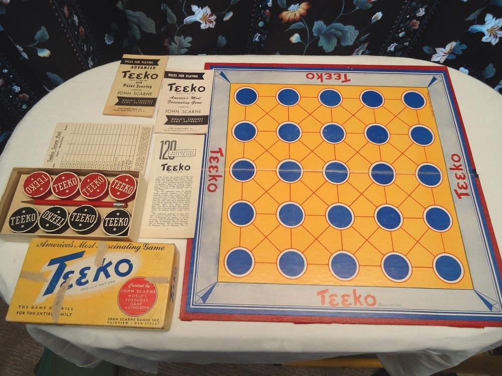

\newpage

# Teeko

## Description

Teeko is an abstract strategy game invented by John Scarne in 1937 and re-released in refined
form in 1952 and again in the 1960s.
Teeko was marketed by Scarne's company, John Scarne Games Inc.;
its quirky name, he said, borrowed letters from Tic-tac-toe, Chess, Checkers, and Bingo [@teeko_etymology].

Teeko is a 2-player board game played on a board of 5x5 possible positions.
Game pieces in Teeko are typically called 'markers', and will henceforth be referred to as such.
Both players have 4 markers each, with a particular colour of marker for each player.

In the original Teeko game, players had two (2) colours of markers: black, and red.
For the sake of easy discernment of the board state in this project, the markers are
instead available in black and white,
with the player controlling the black markers known as Black, and the other as Red.

{width=500px}

## Gameplay and rules

Teeko can be divided into two phases: the drop phase and the move phase.

The game starts on an empty board and the first phase, the **drop phase**, begins. It consists
of players taking turns placing their markers (4 for each, 8 total) into empty cells on the board,
with Black taking the first turn.
If a player isn't careful, they can risk defeat in the drop phase by not preventing the
opponent from placing their markers in a winning position.

If no player won in the drop phase, the **move phase** begins.
In the move phase, players take turns moving one of their markers until a winning position is found.
A game piece can only be moved to one empty adjacent space, in any direction (horizontal, vertical, or diagonal).

## Win condition

The game is over and a player is victorious only when their markers are arranged in a straight line in any
direction (horizontal, vertical, or diagonal) or when they form a square of four (4) adjacent markers.

{width=300px height=300px}

\pagebreak

## Game board

### Definition

The game board will be defined internally as a list of lists. Each element of
the outer list represents a row in the board, with each element of a row
corresponding to a cell, i.e., a position on the board. 
Here are some examples of board states:

~~~prolog
/* Starting board: All cells are empty, defined by the atom e */
board([
  [e, e, e, e, e],
  [e, e, e, e, e],
  [e, e, e, e, e],
  [e, e, e, e, e],
  [e, e, e, e, e]
]).
~~~

~~~prolog
/* Intermediate board: Some markers on the board, neither player winning */
/* The atom b represents the Black markers */
/* The atom w epresents the White markers */
board([
  [e, e, b, e, e],
  [e, e, b, w, b],
  [e, e, b, w, e],
  [e, w, w, e, e],
  [e, e, e, e, e]
]).
~~~

~~~prolog
/* Finishing board: Black wins in this scenario */
board([
  [e, e, e, e, e],
  [e, w, b, e, e],
  [e, e, b, e, e],
  [e, w, b, w, e],
  [e, w, b, e, e]
]).
~~~

\newpage

### Visualization

The game board will be defined as such, where:

- B represents a black marker
- W represents a white marker

~~~
    1   2   3   4   5
  ---------------------
a |   |   | W |   |   |
  ---------------------
b |   | B | W | W |   |
  ---------------------
c |   | W | B |   |   |
  ---------------------
d |   |   | B | B |   |
  ---------------------
e |   |   |   |   |   |
  ---------------------
~~~

In order to print this board on the screen, some Prolog predicates need to be defined.
The main predicate that will print the state of the game is named `display_game(+Board, +Player)`.
It will first print the board in a way similar to the example above, and then print
some information regarding what can be done from this state: either a winning condition is
found and victory is granted to the respective player and the game is over,
or it will display which player's turn it is to move.

This predicate has been implemented in the following way:

~~~prolog
:-use_module(library(lists)).

count_elements([],0).
count_elements([_|Tail], N) :-
  count_elements(Tail, X),
  N is X+1.

% Board grid line indicators
print_char(4) :-
  write(' A ').
print_char(3) :-
  write(' B ').
print_char(2) :-
  write(' C ').
print_char(1) :-
  write(' D ').
print_char(0) :-
  write(' E ').

% Board position indicators
print_char(e) :-
  write(' ').
print_char(b) :-
  write('B').
print_char(w) :-
  write('W').

print_line([]):-
  write('|'),
  write('\n').

print_line([Char | Chars]):-
  write('| '),
  print_char(Char),
  write(' '),
  print_line(Chars).

% display_game(+Board, +Player)
display_game([], _Player):-
  write('   ---------------------'),
  write('\n').

display_game([L | Ls], _Player) :-
  count_elements(Ls, Y),
  (Y =:= 4 ->
    write('\n     1   2   3   4   5  \n'),
    write('   ---------------------')
  ; write('   ---------------------')
  ),
  write('\n'),
  print_char(Y),
  print_line(L),
  display_game(Ls, _Player).
~~~

\newpage
\setlength\parindent{0pt}

# References
